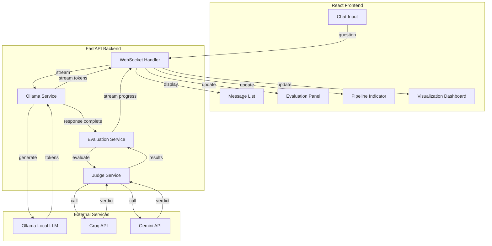

# Design Document: Chat Interface Redesign

## Overview

This design transforms the LLM Judge Auditor web application from a manual source/candidate input interface into a conversational chat interface. Users ask questions, Ollama generates responses, and API judges (Groq/Gemini) automatically evaluate the responses with real-time visualization of metrics and reasoning.

## Architecture



## Components and Interfaces

### Frontend Components

#### 1. ChatInput Component
- Single text input field with send button
- Keyboard shortcut (Enter to send)
- Disabled state when processing
- Character count indicator

#### 2. MessageList Component
- Displays user questions and LLM responses
- Supports streaming text display
- Shows typing indicator during generation
- Expandable evaluation summaries per message

#### 3. EvaluationPanel Component
- Hallucination score thermometer (0-100)
- Individual judge score cards
- Disagreement warning indicator
- Expandable reasoning sections

#### 4. PipelineIndicator Component
- Visual step indicator showing:
  1. Response Generation
  2. Claim Extraction
  3. Fact Checking
  4. Judge Scoring
  5. Aggregation
- Progress animation for current stage

#### 5. ClaimBreakdown Component
- List of extracted claims
- Verdict badges (Supported/Refuted/Not Enough Info)
- Claim type labels (numerical, temporal, definitional)
- Text highlighting in original response

### Backend Services

#### 1. OllamaService
```python
class OllamaService:
    async def generate_stream(
        self,
        question: str,
        model: str,
        conversation_history: List[Message]
    ) -> AsyncGenerator[str, None]:
        """Stream tokens from Ollama."""
        
    async def list_models(self) -> List[OllamaModel]:
        """Get available Ollama models."""
        
    async def check_health(self) -> bool:
        """Check if Ollama is running."""
```

#### 2. ChatEvaluationService
```python
class ChatEvaluationService:
    async def evaluate_response(
        self,
        question: str,
        response: str,
        session_id: UUID,
        judges: List[str]
    ) -> EvaluationResult:
        """Evaluate LLM response with streaming progress."""
        
    async def extract_claims(
        self,
        response: str
    ) -> List[Claim]:
        """Extract factual claims from response."""
```

### WebSocket Events

```typescript
// Client → Server
interface ChatMessage {
    type: 'chat_message';
    question: string;
    model?: string;
}

// Server → Client
interface StreamToken {
    type: 'stream_token';
    token: string;
    done: boolean;
}

interface EvaluationProgress {
    type: 'evaluation_progress';
    stage: 'generation' | 'claim_extraction' | 'verification' | 'scoring' | 'aggregation';
    progress: number;
    message: string;
}

interface JudgeVerdict {
    type: 'judge_verdict';
    judge_name: string;
    score: number;
    confidence: number;
    reasoning: string;
    issues: FlaggedIssue[];
}

interface EvaluationComplete {
    type: 'evaluation_complete';
    consensus_score: number;
    hallucination_score: number;
    claims: ClaimVerdict[];
    metadata: EvaluationMetadata;
}
```

## Data Models

### ChatSession
```python
class ChatSession(Base):
    id: UUID
    user_id: UUID
    created_at: datetime
    updated_at: datetime
    ollama_model: str
    messages: List[ChatMessage]
```

### ChatMessage
```python
class ChatMessage(Base):
    id: UUID
    session_id: UUID
    role: str  # 'user' | 'assistant'
    content: str
    created_at: datetime
    evaluation_id: Optional[UUID]  # Link to evaluation results
```

### ClaimVerdict
```python
class ClaimVerdict(Base):
    id: UUID
    evaluation_id: UUID
    claim_text: str
    claim_type: str  # 'numerical' | 'temporal' | 'definitional' | 'general'
    verdict: str  # 'SUPPORTED' | 'REFUTED' | 'NOT_ENOUGH_INFO'
    confidence: float
    judge_name: str
    text_span_start: int
    text_span_end: int
```

## Correctness Properties

*A property is a characteristic or behavior that should hold true across all valid executions of a system-essentially, a formal statement about what the system should do. Properties serve as the bridge between human-readable specifications and machine-verifiable correctness guarantees.*

### Property 1: Question submission creates message
*For any* non-empty question submitted by a user, the question SHALL appear in the message list as a user message bubble.
**Validates: Requirements 1.2, 1.3**

### Property 2: Empty input disables send
*For any* state where the input field is empty or contains only whitespace, the Send button SHALL be disabled.
**Validates: Requirements 1.4**

### Property 3: Ollama receives all questions
*For any* submitted question, the backend SHALL forward it to Ollama for response generation.
**Validates: Requirements 2.1**

### Property 4: Streaming tokens appear incrementally
*For any* Ollama response being generated, tokens SHALL appear in the UI as they are received, not all at once.
**Validates: Requirements 2.2, 2.5**

### Property 5: Complete responses become messages
*For any* complete Ollama response, it SHALL be displayed as an assistant message bubble in the chat.
**Validates: Requirements 2.3**

### Property 6: Automatic judge evaluation
*For any* complete Ollama response, the system SHALL automatically trigger evaluation by configured API judges.
**Validates: Requirements 3.1**

### Property 7: Judge verdicts appear incrementally
*For any* judge that completes evaluation, its verdict SHALL appear in the UI before other judges finish.
**Validates: Requirements 3.3**

### Property 8: Consensus score calculation
*For any* evaluation where all judges complete, the consensus score SHALL be the weighted average of individual scores.
**Validates: Requirements 3.4**

### Property 9: Hallucination score display
*For any* completed evaluation, the hallucination score thermometer SHALL display a value between 0 and 100.
**Validates: Requirements 4.1**

### Property 10: Disagreement detection
*For any* evaluation where judge scores have variance above threshold, a disagreement warning SHALL be displayed.
**Validates: Requirements 4.3**

### Property 11: Issue severity badges
*For any* flagged issue, it SHALL be displayed with a severity badge (Minor, Moderate, or Severe).
**Validates: Requirements 4.4**

### Property 12: Score color coding
*For any* displayed score, scores >= 80 SHALL be green, scores 50-79 SHALL be yellow, and scores < 50 SHALL be red.
**Validates: Requirements 4.5**

### Property 13: Claim verdict display
*For any* extracted claim, it SHALL be displayed with a verdict badge (Supported, Refuted, or Not Enough Info).
**Validates: Requirements 5.4**

### Property 14: Conversation history inclusion
*For any* follow-up question, the Ollama prompt SHALL include all previous messages from the session.
**Validates: Requirements 6.1**

### Property 15: Chronological message order
*For any* conversation, messages SHALL be displayed in chronological order (oldest first).
**Validates: Requirements 6.2**

### Property 16: Model selection persistence
*For any* model selection change, subsequent Ollama calls SHALL use the newly selected model.
**Validates: Requirements 7.2**

### Property 17: Pipeline stage progression
*For any* evaluation, the pipeline indicator SHALL progress through stages in order: Generation → Claim Extraction → Fact Checking → Judge Scoring → Aggregation.
**Validates: Requirements 8.1, 8.2, 8.4**

### Property 18: Judge failure annotation
*For any* judge that fails or times out, its verdict SHALL be annotated as "Unavailable" in the UI.
**Validates: Requirements 9.1**

### Property 19: Partial results display
*For any* evaluation with partial results, available results SHALL be displayed with appropriate annotations.
**Validates: Requirements 9.4**

### Property 20: Metadata completeness
*For any* completed evaluation, the metadata SHALL include Ollama model name, judge models used, and timestamps.
**Validates: Requirements 10.1, 10.2, 10.3**

### Property 21: Export data completeness
*For any* export operation, the exported data SHALL include the question, response, all judge verdicts, and metrics.
**Validates: Requirements 11.3**

### Property 22: State restoration
*For any* browser reload, the conversation and evaluation state SHALL be restored from persistent storage.
**Validates: Requirements 12.4**

### Property 23: Claim routing display
*For any* claim routed to a specialized judge, the UI SHALL display which judge handled it.
**Validates: Requirements 13.1, 13.2**

## Error Handling

### Ollama Errors
- Connection refused: Display "Ollama is not running. Please start Ollama."
- Model not found: Display "Model not available. Please select a different model."
- Timeout: Display "Response generation timed out. Please try again."

### Judge API Errors
- Rate limit: Retry with exponential backoff, annotate as "Rate limited" if exhausted
- Authentication: Display "API key invalid. Please check settings."
- Timeout: Annotate verdict as "Unavailable", continue with other judges

### WebSocket Errors
- Disconnection: Attempt reconnection with exponential backoff
- Message parsing: Log error, skip malformed message

## Testing Strategy

### Unit Tests
- Component rendering tests for all UI components
- Service method tests for OllamaService and ChatEvaluationService
- WebSocket message parsing tests

### Property-Based Tests
Using Hypothesis (Python) and fast-check (TypeScript):
- Test that all submitted questions appear in message list
- Test that streaming tokens accumulate correctly
- Test that consensus scores are calculated correctly
- Test that color coding matches score ranges
- Test that export includes all required fields

### Integration Tests
- End-to-end chat flow with mocked Ollama
- WebSocket streaming tests
- Judge evaluation pipeline tests

### Accessibility Tests
- Keyboard navigation tests
- Screen reader compatibility tests
- Color contrast tests
